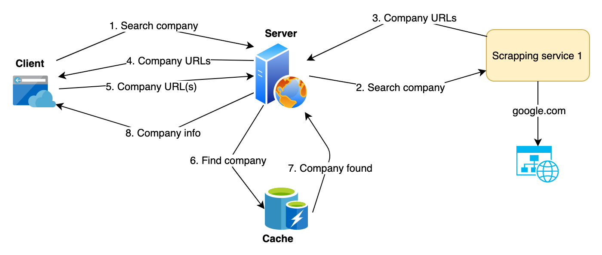

# company-scraper-server

[](https://travis-ci.com/nicolaspayot/company-scraper-server)

## Context

`company-scraper-server` is a web server app built with Node.js and [hapi](https://github.com/hapijs/hapi) framework, whose purpose is to scrap company information from different sources such as [linkedin.com](https://www.linkedin.com) and [societe.com](https://www.societe.com).

## Use cases

Here are some high level design schemas to describe 3 different use cases:

### Cache hit



### Cache miss / DB hit


### Cache miss / DB miss


_**Disclaimer**: there is actually no cache involved in this version of `company-scraper-server`. Schemas show how it would ideally work. It could be implemented with Redis or Memcached for example, but it seems a little bit overkill for now._

## Low level design

### API

`company-scraper-server` serves a REST API implemented with hapi. It has 2 routes:

#### `POST /api/companies/query`

Returns a list of company pages (URLs) that match `query`, from [linkedin.com](https://www.linkedin.com) and [societe.com](https://www.societe.com).

- Parameters

```javascript
{
  query: 'company_name';
}
```

#### `POST /api/company/urls`

Returns company information from company page(s) URL(s).

- Parameters

```javascript
{
  linkedin: 'https://www.linkedin.com/company/company-name',
  societe: 'https://www.societe.com/societe/company-name'
}
```

_Only 1 URL is required (linkedin OR societe OR both)_

### Scraping

Scraping services use [puppeteer](https://github.com/GoogleChrome/puppeteer) to extract data from company pages.

### Persistence

Company information data is persisted in a MongoDB collection, named `companies`. Thus, when a company whose data was already scraped is researched, its data from DB is returned. A scheduled job triggers a _cleaning_ of old companies (it should run everyday at midnight).

## Setup

### ⚠️ Requirements ⚠️

- Node v10+
- yarn
- A Linkedin account: we need to be logged in to scrap company data from [linkedin.com](https://www.linkedin.com)
- A MongoDB database: you can create one on MongoDB Atlas if necessary (see https://docs.mongodb.com/manual/tutorial/atlas-free-tier-setup/)
- A `.env` file at project's root for environment variables

#### `.env` file properties

- Copy `.env.example` file and rename it by `.env`
- Add Linkedin credentials
- Add MongoDB connection string URI

### Usage

```bash
$ yarn install    # install dependencies
$ yarn serve      # start dev with server with nodemon
$ yarn lint       # lints files
$ yarn lint:fix   # lints and fixes files
$ yarn test       # run unit tests with Jest
```
